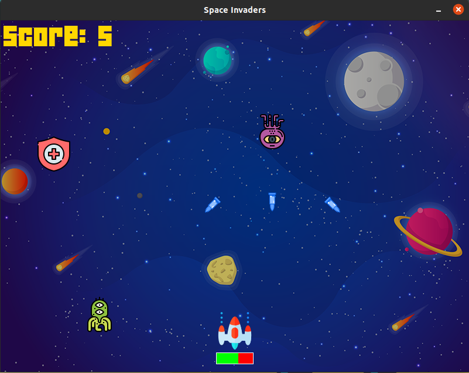
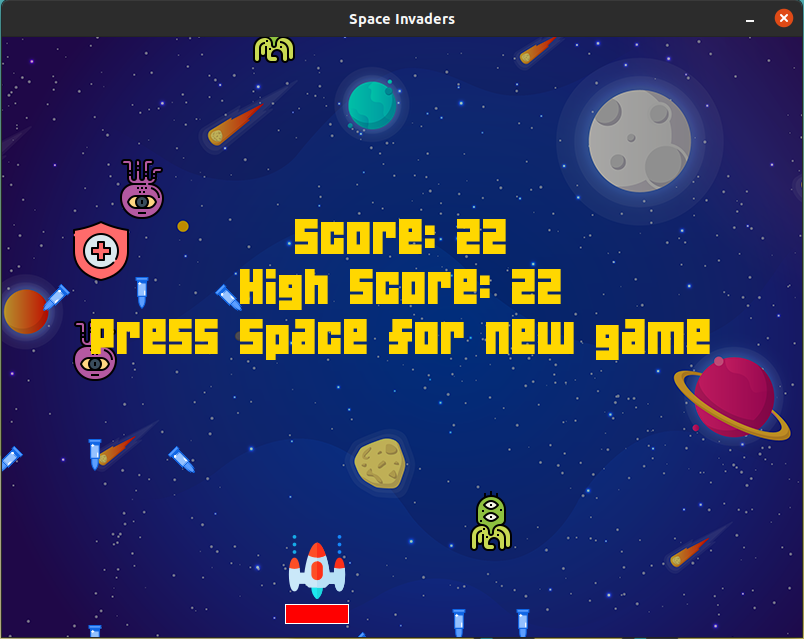

# space-invaders
 - Built a classic Space Invaders game with score tracking and sound effects in Python using the Pygame module.
 - Implemented features like health bar, health recovery and three types of aliens with different damage and laser shooting

